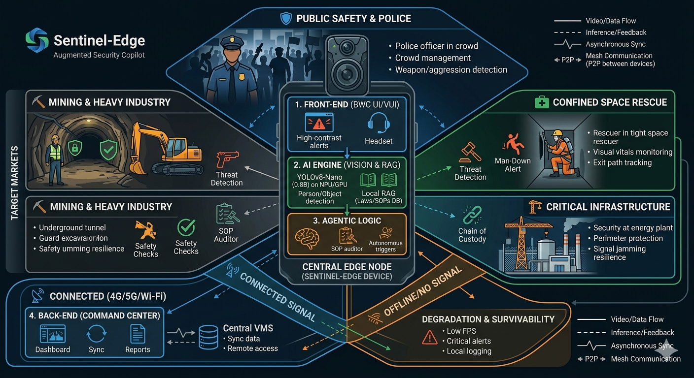

# 🚨 SentinelEdge: AI-Powered Augmented Security Copilot

---

## 📌 The Problem

Modern security and emergency operations rely heavily on cloud-based intelligence. However, in mission-critical environments, such as deep-shaft mining, high-density public protests, or confined-space rescue, connectivity is often **intermittent, latent, or non-existent** .

Current Body-Worn Cameras (BWCs) are "dumb" recording devices. They capture evidence but do nothing to **prevent** incidents or assist the operator in real-time. This leads to:

- **SOP Non-compliance:** High legal and physical risk due to protocol errors.
- **Situational Blindness:** Operators are isolated without tactical support in dark-zones.
- **Data Fatality:** High costs of transmitting 24/7 video to the cloud for analysis.

## 💡 The Idea

**SentinelEdge** is an "Augmented Guard" framework that transforms a standard Android-based BWC (or smartphone) into an autonomous tactical partner. By embedding a **0.8B parameter YOLO model** and a **Local RAG (Retrieval-Augmented Generation)** agent directly on the device, we provide real-time assistance, threat detection, and legal guidance without requiring a single byte of cloud data.

---

## 🏗 Architecture

### 1. Front-End (The "Operator Interface")

- **Target Hardware:** Android-based Bodycams (e.g., Dahua MPT Series) or Rugged Smartphones.
- **UI/UX:** Minimalist Overlay. High-contrast alerts for low-visibility environments.
- **Voice UI (VUI):** Full-duplex audio for "Hands-Free" interaction.

### 2. AI Engine (The "Vision")

- **Model:** YOLOv8-Nano (Optimized for NPU/GPU via TFLite/NCNN).
- **Inference Strategy:**
  - _Eco-Mode:_ 1 FPS (Passive monitoring).
  - _Tactical-Mode:_ 15-30 FPS (Active engagement/SOP check).
- **Local RAG:** A vectorized database of laws (e.g., Chilean Law 21.659) and corporate SOPs stored on the device's eMMC.

### 3. Agentic Logic (The "Brain")

- **Autonomous Triggers:** Automatically initiates recording and broadcasts "Officer Down" alerts if a fall or a weapon is detected.
- **SOP Auditor:** Compares real-time video actions against a pre-loaded "Procedural Tree" to whisper guidance to the operator.

### 4. Back-End (The "Command Center")

- **Sync-when-Ready:** Asynchronous data synchronization. Metadata and logs are pushed to the central VMS only when a secure Wi-Fi/4G connection is re-established.
- **Dashboard:** Audit-ready reports with AI-generated incident summaries.

---

## 🎯 Target Markets

- **⛏️ Mining & Heavy Industry:** Safety protocol enforcement in underground tunnels and remote pits.
- **🛡️ Public Safety & Police:** Real-time legal guidance during arrests and threat detection in crowded areas.
- **⛑️ Confined Space Rescue:** Vital sign monitoring (via visual cues) and exit-path tracking in low-signal environments.
- **🏗️ Critical Infrastructure:** Protection of energy plants and water reserves where signal jamming is a risk.

---

## 🚀 Strategic Features

### Current Roadmap

- **[ ] Threat Detection:** Real-time identification of firearms, knives, and aggressive postures.
- **[ ] Man-Down Alert:** Accelerometer + Vision fusion to detect fallen or incapacitated personnel.
- **[ ] Legal "Whisperer":** Local RAG providing step-by-step legal requirements during a detention.
- **[ ] Automatic Chain of Custody:** Blockchain-based local timestamping of video segments.

### Future Implementations

- **Biometric White-listing:** On-device facial recognition for authorized personnel only (GDPR/Local Law compliant).
- **Multi-Agent Mesh:** Bodycams "talking" to each other via Bluetooth/P2P to share tactical info without a cellular network.
- **Thermal Fusion:** Integration with thermal sensors for search and rescue in smoke-filled environments.

---

## 🛠 Getting Started (Prototype)

1. **Clone the Repo:**`git clone [https://github.com/your-user/sentinel-edge.git](https://github.com/your-user/sentinel-edge.git)`
2. **Model Export:** Export your YOLOv8-Nano model to `.tflite` or `.onnx` optimized for Android NPU.
3. **Environment:** Requires Android Studio Hedgehog+ and a device with a dedicated AI accelerator (Qualcomm Hexagon or similar).

---

> **Mission Statement:** To ensure that those who protect us are never alone, regardless of the signal strength.
